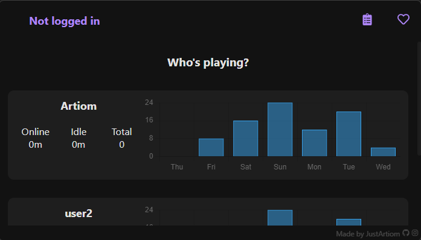
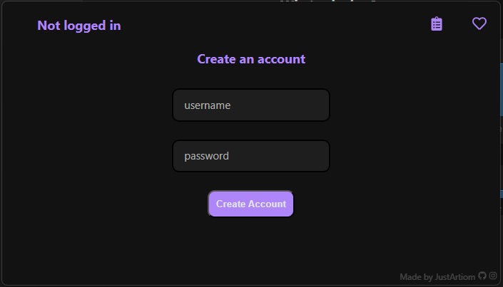
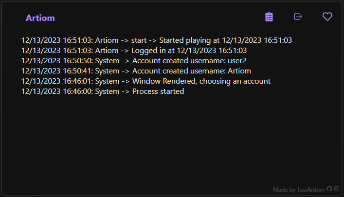
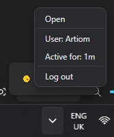

> [!WARNING]  
> This is a **prototype** which may contain lots of bugs, unoptimised code or even memory leaks. Use at own risk. Official version comming SOON™

# ⏱️ Time trekker

A prottotype program that lets you track time of your or other users screentime.

  
  
  

# Soon

New improved version comming soon. It will contain:

1. Typescript
1. More optimised code
1. More handlers for easy understanding and development
1. Bug fixes _(hopefully)_

# Currently known bugs:

This is a prototype so it is normaly to have bugs and i will fix them in the official v1

1. Lauch on start: Cannot open database file
1. Graphs are not in real time
1. Error occurred in handler for 'user-record'
